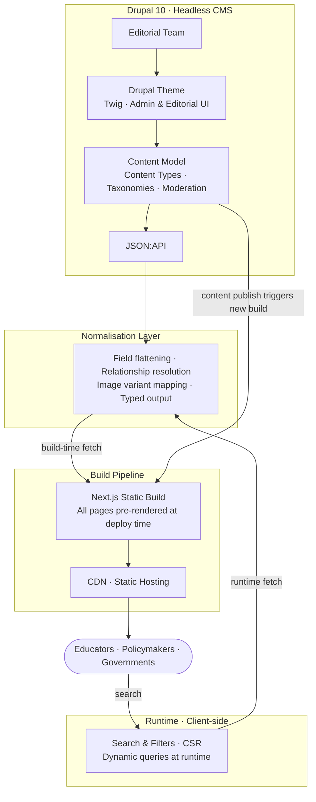

## Overview

A major global initiative — developed by UNICEF's Global Learning Innovation Hub in partnership with the Ministry for Foreign Affairs of Finland, the Asian Development Bank (ADB), and Arm — needed a platform to surface high-quality, rigorously evaluated EdTech tools for educators, governments, and policymakers worldwide.

The platform is built on the EdTech for Good Framework: every tool listed undergoes expert evaluation across learning impact, scalability, inclusivity, and data security before being published. The result needed to be a fast, searchable discovery experience backed by a CMS capable of managing a continuously growing catalogue — without developer involvement in day-to-day content operations.

The stack: headless Drupal 10 as the content and editorial backend, Next.js App Router as the public-facing frontend.

### System Architecture



## The Problem

Three distinct challenges shaped the architecture:

- **Structured catalogue at scale**: 500+ EdTech tools, each evaluated across multiple dimensions, needed a flexible content model supporting rich filtering, taxonomies, expert scoring, and editorial workflows — all manageable by non-technical staff.
- **Decoupled yet editorially complete**: The editorial team needed full CMS control (moderation states, previews, structured fields) while the frontend had to be independently deployable and optimised for a global audience — many of whom are in bandwidth-constrained environments.
- **Dual-mode Drupal**: The project required both a traditional Drupal theme for certain admin and editorial interfaces, and a fully decoupled Next.js frontend for the public site. Both paradigms had to coexist cleanly within the same Drupal installation.

## My Role

As Lead Frontend Engineer, I held end-to-end ownership of the frontend stack and contributed to back-end architecture alongside the Drupal team:

- Architecting and building the Next.js App Router frontend from scratch
- Building and maintaining the Drupal theme (Twig templates, CSS, JS) for editorial and admin-facing views
- Designing the content delivery layer between Drupal's JSON:API and Next.js
- Contributing to Drupal content modelling — content types, field configuration, taxonomy structures, and moderation workflows
- Setting up deployment pipelines and environment configurations

## Approach

### Content modelling in Drupal

Each EdTech tool in the catalogue is a structured Drupal content type with fields covering tool metadata, evaluation scores, target audience, subject areas, supported languages, offline capability, and infrastructure requirements. Getting this model right early was critical — it directly shaped what the frontend could filter, search, and display.

Taxonomy vocabularies handled classification (subject, age group, geography, connectivity requirements), enabling multi-dimensional filtering without custom query logic on the frontend.

### Headless delivery via JSON:API

Rather than exposing Drupal's raw JSON:API responses directly to Next.js, we built a normalisation layer that flattened nested relationships and resolved entity references into a predictable, typed structure. This meant the frontend components were insulated from Drupal's internal data shape — content type changes in Drupal didn't ripple into the Next.js codebase.

```ts
type EdTechTool = {
  id: string
  title: string
  summary: string
  evaluationScores: {
    learningImpact: number
    scalability: number
    inclusivity: number
    dataSecurity: number
  }
  tags: string[]
  languages: string[]
  offlineCapable: boolean
  targetAgeGroups: string[]
  image: {
    src: string
    alt: string
  }
}
```

### Drupal theme for editorial interfaces

Not every view needed to be decoupled. Certain admin and editorial interfaces — tool submission forms, moderation dashboards, evaluation workflows — were better served by Drupal's native theming system. I built and maintained a Drupal theme using Twig templates that gave the editorial team a consistent, branded experience within the CMS while keeping those views out of the Next.js surface area.

### Rendering strategy

The entire site is statically generated at build time. Every page — tool catalogue, individual tool detail, and static content — is SSG-rendered and deployed as a static build. Content updates in Drupal trigger a new build and deployment, keeping the public site in sync with the editorial team's approved changes.

| Page type | Strategy | Rationale |
|---|---|---|
| Tool catalogue | SSG | Built at deploy time, consistent global performance |
| Tool detail | SSG | 500+ tool pages pre-rendered at build |
| Static / about pages | SSG | Infrequent changes, ideal for static generation |
| Search & filters | CSR | Fully dynamic, user-driven queries |

## Key Deliverables

- **Next.js App Router frontend** — full public site implementation with per-page rendering strategies
- **Drupal theme** — Twig-based theme for editorial and admin interfaces within the CMS
- **JSON:API normalisation layer** — typed, predictable content delivery contract between Drupal and Next.js
- **Filtering and discovery UI** — multi-dimensional search and filter across 500+ tools by subject, age group, language, connectivity, and evaluation score
- **Build-triggered deployment pipeline** — Drupal content updates trigger a new static build and deployment
- **Content model contributions** — Drupal content types, taxonomy vocabularies, and moderation workflow configuration

## Results & Impact

- **Beta launched at Slush 2024** — delivered on time for a high-profile international conference debut, representing UNICEF's Global Learning Innovation Hub alongside partners including the Ministry for Foreign Affairs of Finland, ADB, and Arm
- **500+ EdTech tools evaluated and published** — the catalogue went live with a substantial, fully structured dataset, immediately useful to governments and educators
- **Editorial independence** — the content team can manage the full tool lifecycle (submission, evaluation, publication) without engineering involvement
- **Global reach** — the platform serves users across low-bandwidth and connectivity-constrained environments, a core requirement given its audience in emerging education markets

## Lessons Learned

**Content modelling is frontend architecture.** The Drupal content model directly determines what's possible in the frontend. Early investment in getting taxonomy structures, field relationships, and moderation states right — before writing a single React component — paid off significantly as the catalogue scaled.

**Own the contract between systems.** The normalisation layer between Drupal's JSON:API and Next.js was the most important architectural decision on the frontend side. Every time content types evolved in Drupal, the frontend stayed untouched. Without it, each CMS change would have required parallel frontend updates.

**Dual-mode Drupal is a valid pattern.** Running a Drupal theme alongside a decoupled frontend in the same installation is often dismissed in favour of going fully headless. In practice, keeping editorial and admin interfaces in Drupal's native theme — where Drupal's UX is strongest — while decoupling only the public-facing site gave the team the best of both worlds.
