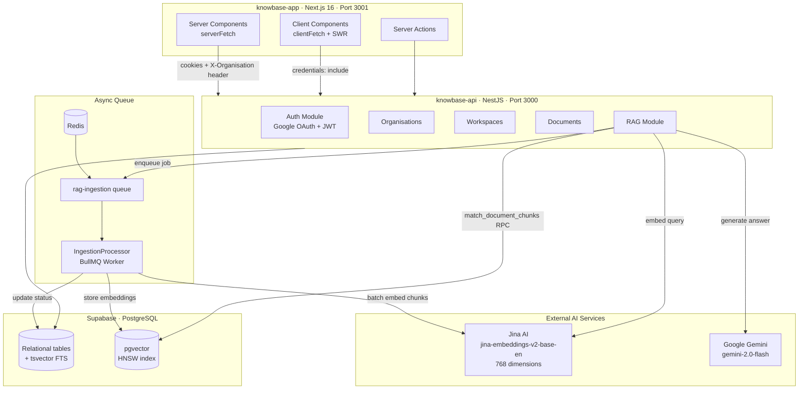
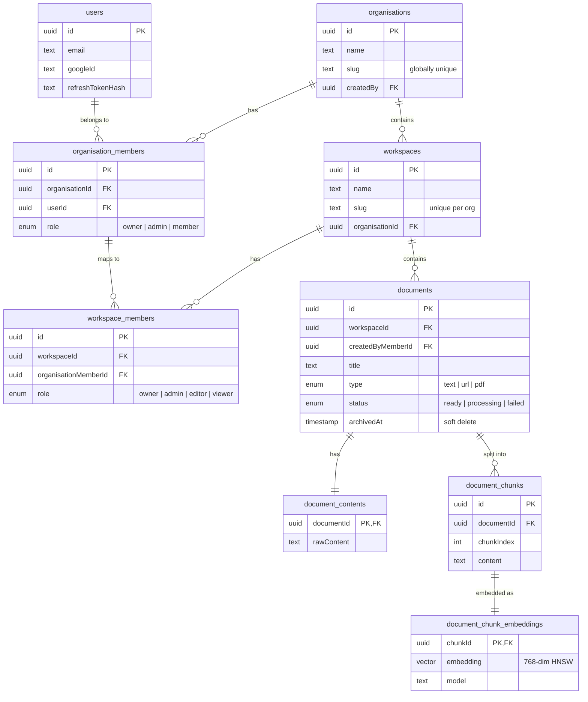
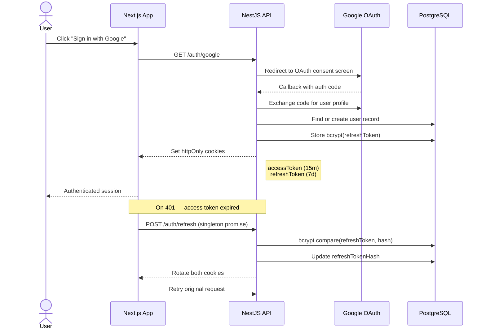
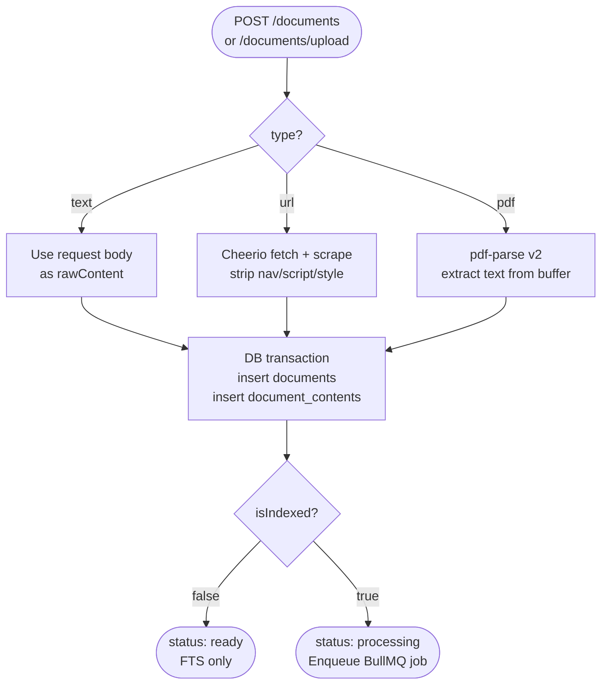
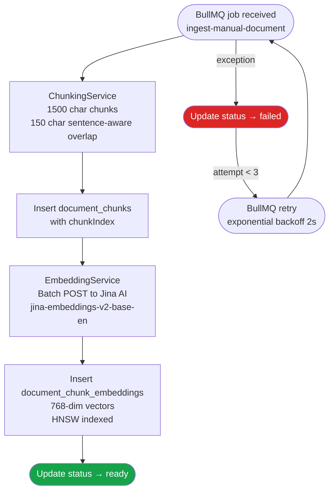
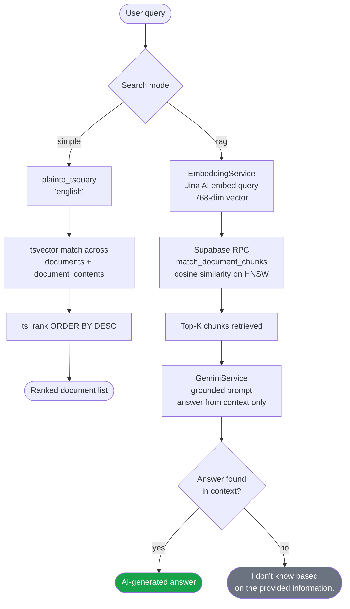
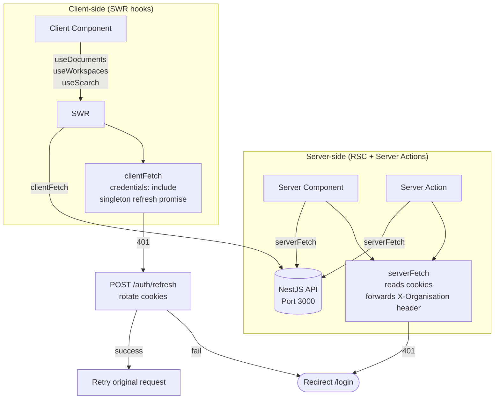

## Overview

Knowbase is a multi-tenant SaaS platform that lets teams organise their collective knowledge into Organisations and Workspaces, ingest documents in multiple formats, and retrieve them through two complementary search modes: traditional full-text search and a retrieval-augmented generation (RAG) pipeline that answers natural-language questions using only the content in the knowledge base.

The system is built on a NestJS API with Drizzle ORM against a Supabase-hosted PostgreSQL instance, paired with a Next.js 16 App Router frontend. The RAG pipeline runs fully asynchronously via BullMQ, embedding documents with Jina AI and querying them through Supabase's pgvector HNSW index before generating answers with Gemini.

### System Architecture



---

## The Problem

Most team knowledge ends up fragmented — scattered across Notion pages, PDFs, internal wikis, and web links that nobody ever searches. The challenge was building a platform where teams could ingest content in whatever format it lives in, search it accurately across large corpora, and — crucially — ask questions against it without getting answers invented from outside their own knowledge base.

Three problems had to be solved in parallel:

- **Ingestion heterogeneity**: Teams store knowledge as typed text, scraped web pages, and uploaded PDFs. Each format needs a different extraction path before any indexing can happen.
- **Search duality**: Keyword search is fast and familiar but misses semantic relationships. Pure vector search is powerful but opaque. Both modes need to coexist in a single coherent UI.
- **RAG hallucination risk**: LLMs will confidently answer outside their context. The pipeline had to strictly ground Gemini's output in retrieved chunks and return a fallback when the answer isn't in the documents.

---

## My Role

Sole architect and engineer across the full stack — API design, database schema, RAG pipeline, async worker infrastructure, and the Next.js frontend.

Primary areas of ownership:

- Multi-tenant data model and role-based access control layer
- Document ingestion pipeline for three content types
- Async RAG ingestion worker (chunking → embedding → pgvector storage)
- Dual search modes: PostgreSQL tsvector full-text and Supabase RPC vector similarity
- Next.js App Router frontend with server/client fetch split and SWR polling

---

## Approach

### Multi-tenant isolation

The tenancy model is three levels deep: **Organisation → Workspace → Document**. Membership at each level is tracked separately, with independent role enums (`owner | admin | member` for orgs; `owner | admin | editor | viewer` for workspaces). The critical design decision was that `workspace_members` links to `organisation_members.id`, not directly to `users` — workspace access is always derived through org membership, making it impossible for a workspace to be accessed by someone outside the parent organisation.

Every document route accepts a workspace identifier that can be either a UUID or a slug, resolved inside `assertWorkspaceAccess` via a single join query that simultaneously validates membership and returns the workspace ID.



### Auth flow



### Document ingestion — three paths, one pipeline

| Type   | Extraction                                                                                       |
| ------ | ------------------------------------------------------------------------------------------------ |
| `text` | Raw content from request body, stored directly                                                   |
| `url`  | Cheerio scrapes the page, strips `script / style / nav / header / footer`, normalises whitespace |
| `pdf`  | `pdf-parse` v2 class API (`new PDFParse({ data: buffer }).getText()`) extracts body text         |

All three paths converge at the same transaction: insert into `documents`, insert raw content into `document_contents`, then optionally enqueue for RAG indexing. The `isIndexed` flag on the DTO controls whether the document enters the async pipeline immediately or stays as a plain searchable document.



### RAG pipeline design

When `isIndexed: true`, the document status is set to `processing` and a BullMQ job is enqueued on the `rag-ingestion` queue. The `IngestionProcessor` worker handles each job in five steps:

1. **Chunking** — `ChunkingService` splits text into sentence-aware chunks of 1500 chars with 150-char overlap, preventing mid-sentence cuts at chunk boundaries.
2. **Insert chunks** — chunk records written to `document_chunks` with `chunkIndex` for ordered retrieval.
3. **Embed** — `EmbeddingService` sends all chunks in a single batch request to Jina AI's `jina-embeddings-v2-base-en` model (768 dimensions).
4. **Store embeddings** — `document_chunk_embeddings` receives chunk IDs paired with their embedding vectors.
5. **Status update** — document status set to `ready` on success, `failed` on error. BullMQ handles retries (3 attempts, exponential backoff at 2s).

Force re-indexing deletes stale chunks first (cascade removes their embeddings), then re-enqueues. This makes re-indexing safe to call idempotently.



### Dual search

Full-text search uses PostgreSQL's `tsvector` columns on both `documents` and `document_contents`, combined at query time:

```sql
WHERE (d.search_vector || dc.search_vector)
      @@ plainto_tsquery('english', $1)
ORDER BY ts_rank(d.search_vector || dc.search_vector, plainto_tsquery('english', $1)) DESC
```

RAG mode embeds the query with the same Jina model, calls Supabase's `match_document_chunks` RPC (cosine similarity on the HNSW index, top-K chunks), and passes the retrieved context to Gemini with an explicit grounding prompt that instructs it to answer only from the provided context and return a fallback if the answer isn't present.



### Frontend architecture

The Next.js app separates server and client fetch paths at the module level using `"server-only"`. `serverFetch` reads the `X-Organisation` cookie and forwards it as a header alongside all session cookies — no client-side header management needed in server components. `clientFetch` implements a singleton refresh-promise to prevent concurrent token refresh races when multiple SWR hooks fire simultaneously on a 401.

The search UI surfaces both modes in a single page: simple mode renders a standard results list; RAG mode renders a chat-style interface with message history, auto-scroll, auto-refocus after the assistant responds, and a clear-conversation button. Documents with `status === "processing"` trigger a 4-second SWR polling interval that stops automatically once all documents reach a terminal state.



---

## Key Deliverables

- **Multi-tenant API** — NestJS with Drizzle ORM, two-level membership model, guard-based context injection, soft-delete for documents
- **Three-format ingestion** — text, URL (Cheerio), PDF (`pdf-parse`) converging into a single document/content schema
- **Async RAG pipeline** — BullMQ worker with chunking, Jina AI batch embedding, pgvector storage, and document lifecycle state machine
- **Dual search interface** — PostgreSQL tsvector full-text and Supabase HNSW vector similarity with grounded Gemini generation
- **Next.js App Router frontend** — server/client fetch split, SWR with status polling, markdown rendering, table/card view toggle with View Transition API
- **Settings pages** — org and workspace rename/delete (owner-only, with role-checked redirects server-side)

---

## Technical Highlights

### Grounded RAG prompt

Gemini is given a strict system prompt that prevents it from answering outside the retrieved context — a deliberate choice to make the knowledge base trustworthy rather than impressively fluent.

```ts
buildGroundedPrompt(input: GroundedPromptInput): string {
  const context = input.chunks
    .map((c, i) => `Context ${i + 1}:\n${c.content}`)
    .join("\n\n");

  return `
    You are an assistant that answers questions using ONLY the provided context.

    Rules:
    - Use only the context below
    - If the answer is not in the context, say: "I don't know based on the provided information."
    - Do not use prior knowledge.

    Context:
    ${context}

    Question:
    ${input.query}
    `;
}
```

### Processing status polling

SWR's `refreshInterval` is set conditionally — it only polls when there's at least one document in the `processing` state, dropping to zero once all documents settle. This avoids constant background requests for quiescent workspaces.

```ts
refreshInterval: documents?.some((d) => d.status === "processing") ? 4000 : 0;
```

### Membership-scoped access check

Every document operation resolves the workspace through a membership join in one query, which simultaneously validates access and returns the workspace ID. No separate permission check is needed.

```ts
const [member] = await this.db
  .select({ id: schema.workspaces.id })
  .from(schema.workspaceMembers)
  .innerJoin(
    schema.workspaces,
    eq(schema.workspaceMembers.workspaceId, schema.workspaces.id),
  )
  .where(
    and(
      isUuid
        ? eq(schema.workspaces.id, workspaceIdentifier)
        : eq(schema.workspaces.slug, workspaceIdentifier),
      eq(schema.workspaceMembers.organisationMemberId, organisationMemberId),
      eq(schema.workspaces.organisationId, organisationId),
    ),
  )
  .limit(1);

if (!member)
  throw new ForbiddenException("You do not have access to this workspace");
```

---

## Results & Impact

- **Full RAG pipeline end-to-end** — documents are chunked, embedded, and stored asynchronously; queries return Gemini-generated answers grounded strictly in the workspace's own content
- **Three ingestion formats** — teams can add knowledge without reformatting it; URL scraping and PDF extraction happen server-side with no client involvement
- **Sub-second full-text search** — `tsvector` with `plainto_tsquery` and `ts_rank` returns ranked results across document titles and full content bodies
- **Zero hallucination by design** — the RAG prompt's grounding rules mean the assistant explicitly declines to answer when retrieved context doesn't contain the answer

---

## Lessons Learned

**Separate the membership model from the user model early.** Making `workspace_members` link to `organisation_members` (not `users`) meant workspace access is always derived through org membership. This felt like over-engineering at first but prevented an entire class of cross-tenant access bugs later.

**Async status needs a state machine, not a boolean.** Using `processing | ready | failed` instead of a simple `isIndexed` boolean gave the frontend meaningful states to render (spinner, success, retry action) without polling the embeddings table directly. The status column became the single source of truth for pipeline progress.

**Chunk at sentence boundaries, not character boundaries.** A naive character-split chunker would cut mid-sentence, degrading embedding quality and making retrieval less accurate. The sentence-aware chunker with overlap keeps semantic units intact across chunk boundaries, at the cost of slightly more complexity in the splitting logic.

**BullMQ's job lifecycle events are the right observability hook.** Rather than building a separate progress-tracking system, `@OnWorkerEvent('active' | 'completed' | 'failed')` gives enough signal to log and debug pipeline failures without adding another dependency.
